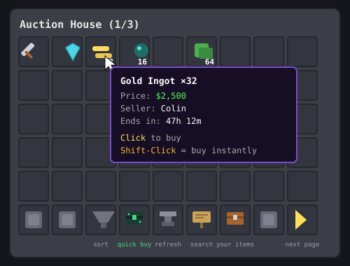
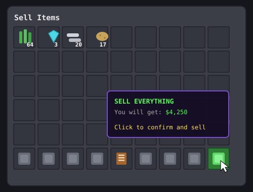
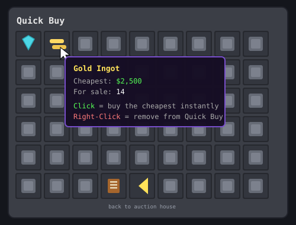

# SMPauctionplugin

A **sell menu** and a modern **auction house** with quick buy — made for
**BladeSMP** (Eaglercraft 1.8 / Spigot 1.8.8 servers).

Needs [SMPmoneyplugin](https://github.com/CLoudyIceOceaN/SMPmoneyplugin)
for the money (the installer grabs it for you automatically).

**Easy download page:** https://cloudyiceocean.github.io/SMPauctionplugin/

---

## How to install — one command

Open the terminal in your Codespace, `cd` into your **server folder**
(the one with the server jar in it), and paste:

```
curl -sL https://cloudyiceocean.github.io/SMPauctionplugin/install.sh | bash
```

That downloads the auction house **and** the money plugin (if you don't
have it yet) into your `plugins` folder. Then **restart the server**.

<details>
<summary>Or install by hand (3 steps)</summary>

1. Download [SMPauctionplugin.jar](https://cloudyiceocean.github.io/SMPauctionplugin/SMPauctionplugin.jar)
   and [SMPmoneyplugin.jar](https://cloudyiceocean.github.io/SMPmoneyplugin/SMPmoneyplugin.jar)
2. Put both in your server's `plugins` folder.
3. Restart the server.
</details>

## What the menus look like

*(mockups — in game it's drawn with real Minecraft item textures)*

| The auction house | The sell menu |
|---|---|
|  |  |

## The auction house — `/ah`

| Type this | What happens |
|---|---|
| `/ah` | Opens the auction house menu |
| `/ah diamond` | Searches the auction house for diamonds (cheapest first) |
| `/ah sell 5k` | Puts the item in your hand up for sale for $5,000 |

Buying:
- **Click** an item → a confirm screen pops up (green = buy, red = cancel)
- **Shift-click** an item → bought **instantly**, no confirm screen

The bottom bar (left to right):
- **Hopper** — sort: newest / cheapest / priciest
- **Ender chest** — **Quick Buy** (see below)
- **Anvil** — refresh, loads the newest auctions
- **Sign** — search (it tells you to type `/ah <item name>`; when a
  search is on, click the sign again to clear it)
- **Chest** — *Your Items*: take things off sale, claim back anything
  expired or cancelled (items stay for sale for 48 hours)
- **Arrow** (bottom right) — next page (a back arrow appears next to it
  when you're past page 1)

Sellers get paid instantly, even if they're offline.

### ⚡ Quick Buy (the ender chest)

Quick Buy is your own page of shortcuts — a grid of gray glass panes:

1. Pick up an item from your inventory (just click it, so it's on
   your cursor)
2. Click any gray pane — the item is **saved** there (you keep the item!)
3. From then on, **clicking that saved item buys the cheapest one on the
   auction house instantly** — no confirm screen, no searching

Each saved item shows the current cheapest price and how many are for
sale. **Right-click** a saved item to remove it. Your Quick Buy page is
remembered forever, even after restarts.



## The sell menu — `/sell`

`/sell` opens a menu. Drop your farm loot in, then hover the **green
glass pane in the bottom-right corner** — it shows exactly how much
you'll get. Click it to confirm and sell everything. Items it can't
sell (and anything renamed or enchanted) are given back, never eaten.

`/worth` (while holding an item) tells you what it pays.

## Changing prices, times, and messages

Everything is in `plugins/SMPauctionplugin/config.yml` on the server:

- **sell-prices** — what each item pays in `/sell` (add or change any item;
  careful, they're 1.8 item names: gunpowder is `SULPHUR`, porkchop is `PORK`)
- **listing** — how long auctions last, max listings per player, min/max
  price, and an optional listing fee
- **messages** and **menu titles** — every single text

Change the file, restart the server, done. (Money settings like the
scoreboard stay in the SMPmoneyplugin config.)

## For people who want to change the code

The Java source is in `src/`. Rebuild on a Mac with Homebrew OpenJDK 21:

```
./build.sh
```

The new jar lands at `SMPauctionplugin.jar`. Commit and push it and the
download page hands out the new version automatically.
